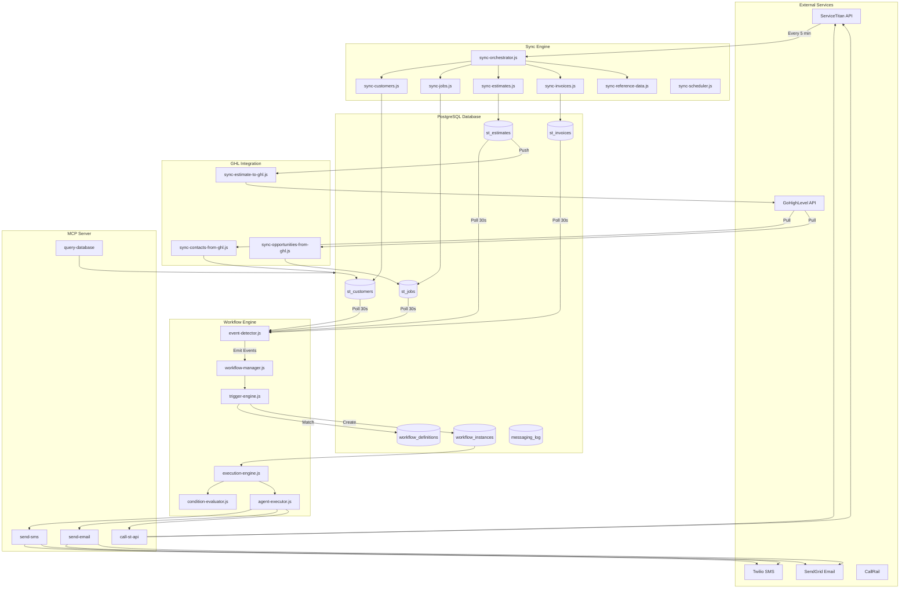

# Data Flow Diagrams

## Complete System Flow



---

## Flow 1: ServiceTitan → Database Sync

```
┌─────────────────────────────────────────────────────────────────────────────┐
│                        SERVICETITAN SYNC FLOW                                │
└─────────────────────────────────────────────────────────────────────────────┘

1. TRIGGER
   ├── Cron Schedule (0 */6 * * * for incremental)
   ├── Manual: npm run sync:initial
   └── API: POST /api/sync/full

2. ORCHESTRATION (sync-orchestrator.js)
   │
   ├── Phase 1: Reference Data
   │   └── syncReferenceData()
   │       ├── GET /settings/v2/tenant/{id}/business-units
   │       ├── GET /settings/v2/tenant/{id}/technicians
   │       ├── GET /jpm/v2/tenant/{id}/job-types
   │       └── GET /marketing/v2/tenant/{id}/campaigns
   │
   ├── Phase 2: Customers
   │   └── syncCustomers()
   │       └── GET /crm/v2/tenant/{id}/customers?pageSize=100
   │           └── UPSERT → st_customers
   │
   ├── Phase 3: Jobs
   │   └── syncJobs()
   │       └── GET /jpm/v2/tenant/{id}/jobs?pageSize=100
   │           └── UPSERT → st_jobs
   │
   └── Phase 4: Related Entities (Parallel)
       ├── syncEstimates()
       │   └── GET /sales/v2/tenant/{id}/estimates
       │       └── UPSERT → st_estimates
       │
       ├── syncAppointments() ❌ 404 Error
       │   └── GET /dispatch/v2/tenant/{id}/appointments
       │
       └── syncInvoices()
           └── GET /accounting/v2/tenant/{id}/invoices
               └── UPSERT → st_invoices

3. LOGGING
   └── INSERT → st_sync_log
       ├── module, sync_type, status
       ├── records_fetched, records_created, records_updated
       └── duration_ms, error_message
```

---

## Flow 2: Event Detection → Workflow Trigger

```
┌─────────────────────────────────────────────────────────────────────────────┐
│                        EVENT DETECTION FLOW                                  │
└─────────────────────────────────────────────────────────────────────────────┘

1. POLLING (event-detector.js)
   │
   ├── Every 30 seconds, check each table:
   │
   ├── st_estimates
   │   └── SELECT * WHERE st_modified_on > lastCheck
   │       ├── New estimate → emit('estimate_created', data)
   │       ├── Status = 'Sold' → emit('estimate_approved', data)
   │       └── Status = 'Dismissed' → emit('estimate_rejected', data)
   │
   ├── st_jobs
   │   └── SELECT * WHERE st_modified_on > lastCheck
   │       ├── New job → emit('job_created', data)
   │       └── Status = 'Completed' → emit('job_completed', data)
   │
   ├── st_invoices
   │   └── SELECT * WHERE st_modified_on > lastCheck
   │       ├── New invoice → emit('invoice_created', data)
   │       └── due_date < NOW() AND balance > 0 → emit('invoice_overdue', data)
   │
   └── st_appointments
       └── SELECT * WHERE st_modified_on > lastCheck
           └── New appointment → emit('appointment_created', data)

2. EVENT HANDLING (workflow-manager.js)
   │
   └── eventDetector.on('estimate_created', (data) => {
           triggerEngine.handleEvent('estimate_created', data);
       });

3. TRIGGER MATCHING (trigger-engine.js)
   │
   ├── Load workflow_definitions WHERE enabled = true
   │
   ├── For each definition:
   │   ├── Check trigger_event matches
   │   ├── Evaluate trigger_conditions against data
   │   └── Check max_concurrent_per_customer
   │
   └── If matched:
       └── INSERT → workflow_instances
           ├── workflow_definition_id
           ├── customer_id
           ├── trigger_data (JSONB)
           ├── current_step = 1
           └── status = 'active'
```

---

## Flow 3: Workflow Execution

```
┌─────────────────────────────────────────────────────────────────────────────┐
│                        WORKFLOW EXECUTION FLOW                               │
└─────────────────────────────────────────────────────────────────────────────┘

1. EXECUTION ENGINE (execution-engine.js)
   │
   ├── Every 10 seconds:
   │   └── SELECT * FROM workflow_instances
   │       WHERE status = 'active'
   │         AND next_step_at <= NOW()
   │
   └── For each instance:

2. STEP PROCESSING
   │
   ├── Get current step from workflow_definitions.steps[current_step]
   │
   ├── Evaluate step.condition (if exists)
   │   └── condition-evaluator.js
   │       ├── Parse expression: "estimate.status == 'Open'"
   │       └── Evaluate against current entity state
   │
   ├── Check stop_conditions
   │   ├── "estimate.status == 'Sold'" → Complete workflow
   │   ├── "workflow.message_count >= 4" → Complete workflow
   │   └── "customer.opted_out == true" → Complete workflow
   │
   └── Execute action via agent-executor.js

3. AGENT EXECUTION (agent-executor.js)
   │
   ├── Parse action: "Send SMS to customer: '{message}'"
   │
   ├── Render template variables:
   │   ├── {customer.name} → "John Smith"
   │   ├── {estimate.total} → "$5,000"
   │   └── {business.phone} → "(555) 123-4567"
   │
   ├── Call appropriate tool:
   │   ├── SMS → Twilio API
   │   └── Email → SendGrid API
   │
   └── Log result:
       └── INSERT → workflow_step_executions
           ├── workflow_instance_id
           ├── step_number
           ├── action_type
           ├── result (success/failure)
           └── response_data

4. ADVANCE WORKFLOW
   │
   ├── UPDATE workflow_instances
   │   ├── current_step = current_step + 1
   │   ├── next_step_at = NOW() + step.delay
   │   └── message_count = message_count + 1
   │
   └── If last step:
       └── status = 'completed'
```

---

## Flow 4: Database → GoHighLevel Sync

```
┌─────────────────────────────────────────────────────────────────────────────┐
│                        GHL SYNC FLOW                                         │
└─────────────────────────────────────────────────────────────────────────────┘

1. ESTIMATE → GHL OPPORTUNITY (sync-estimate-to-ghl.js)
   │
   ├── Trigger: Event detector detects new estimate
   │
   ├── Query:
   │   SELECT e.*, c.*, j.*, bu.ghl_pipeline_id
   │   FROM st_estimates e
   │   JOIN st_customers c ON e.customer_id = c.st_id
   │   JOIN st_jobs j ON e.job_id = j.st_id
   │   JOIN st_business_units bu ON j.business_unit_id = bu.st_id
   │   WHERE e.st_id = ?
   │
   ├── Check: bu.ghl_pipeline_id exists
   │
   ├── Find/Create GHL Contact:
   │   └── POST https://services.leadconnectorhq.com/contacts/
   │       ├── email: customer.email
   │       ├── phone: customer.phone
   │       └── name: customer.name
   │
   └── Create GHL Opportunity:
       └── POST https://services.leadconnectorhq.com/opportunities/
           ├── pipelineId: bu.ghl_pipeline_id
           ├── name: "Estimate #{estimate.number}"
           ├── monetaryValue: estimate.total
           ├── contactId: ghl_contact_id
           └── customFields: { st_job_id, st_estimate_id }

2. GHL → DATABASE (sync-opportunities-from-ghl.js)
   │
   ├── GET https://services.leadconnectorhq.com/opportunities/
   │
   └── For each opportunity:
       └── UPSERT → ghl_opportunities ❌ TABLE NOT EXISTS
           ├── ghl_id
           ├── st_job_id (from customFields)
           ├── pipeline_stage_id
           ├── monetary_value
           └── status

3. GHL CONTACTS → DATABASE (sync-contacts-from-ghl.js)
   │
   ├── GET https://services.leadconnectorhq.com/contacts/
   │
   └── For each contact:
       └── Match to st_customers by phone/email
           └── UPDATE st_customers SET ghl_contact_id = ?
```

---

## Flow 5: MCP Tool Execution

```
┌─────────────────────────────────────────────────────────────────────────────┐
│                        MCP TOOL EXECUTION FLOW                               │
└─────────────────────────────────────────────────────────────────────────────┘

Claude Desktop / AI Agent
         │
         ▼
┌─────────────────────┐
│   MCP Server        │
│   (stdio transport) │
└─────────────────────┘
         │
         ├── Tool: query_database
         │   └── Execute SQL against PostgreSQL
         │       └── Return results as JSON
         │
         ├── Tool: call_st_api
         │   └── Proxy request to ServiceTitan API
         │       ├── Handle authentication
         │       └── Return API response
         │
         ├── Tool: send_sms
         │   └── POST to Twilio API
         │       ├── From: TWILIO_PHONE_NUMBER
         │       ├── To: customer phone
         │       └── Body: message
         │
         ├── Tool: send_email
         │   └── POST to SendGrid API
         │       ├── From: configured sender
         │       ├── To: customer email
         │       └── Subject/Body: from template
         │
         ├── Tool: create_job
         │   └── POST /jpm/v2/tenant/{id}/jobs
         │       └── Create new ServiceTitan job
         │
         └── Tool: schedule_appointment
             └── POST /dispatch/v2/tenant/{id}/appointments
                 └── Schedule technician visit
```

---

## Data Transformation Summary

| Source | Transformation | Destination |
|--------|---------------|-------------|
| ST /customers | Flatten, normalize phone | st_customers |
| ST /jobs | Map status, extract tags | st_jobs |
| ST /estimates | Parse items, calculate total | st_estimates |
| ST /invoices | Parse amounts, track balance | st_invoices |
| st_estimates | Build opportunity payload | GHL /opportunities |
| st_customers | Build contact payload | GHL /contacts |
| workflow_definitions.steps | Parse action, render template | Twilio/SendGrid |
