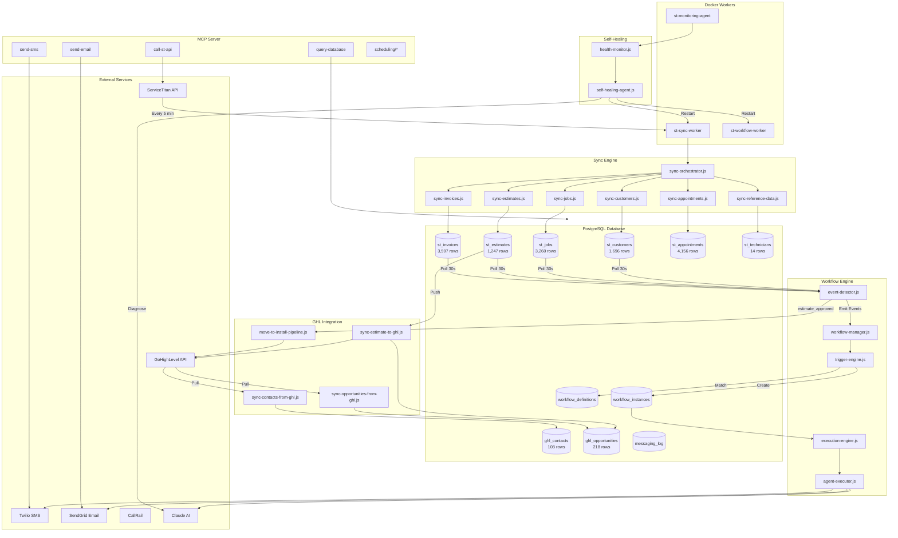

# Data Flow Diagrams

*Last Updated: 2025-12-20*

## Complete System Flow



---

## Flow 1: ServiceTitan → Database Sync

```
┌─────────────────────────────────────────────────────────────────────────────┐
│                        SERVICETITAN SYNC FLOW                                │
│                        ✅ FULLY OPERATIONAL                                  │
└─────────────────────────────────────────────────────────────────────────────┘

1. TRIGGER
   ├── Cron Schedule (*/5 * * * * for incremental - every 5 minutes)
   ├── Cron Schedule (0 2 * * * for full - daily at 2 AM)
   ├── Manual: npm run sync:st-incremental
   └── API: POST /api/sync/full

2. ORCHESTRATION (sync-orchestrator.js)
   │
   ├── Phase 1: Reference Data (daily at 2 AM)
   │   └── syncReferenceData()
   │       ├── GET /settings/v2/tenant/{id}/business-units → st_business_units
   │       ├── GET /settings/v2/tenant/{id}/technicians → st_technicians (14 records) ✅
   │       ├── GET /jpm/v2/tenant/{id}/job-types → st_job_types
   │       └── GET /marketing/v2/tenant/{id}/campaigns → st_campaigns
   │
   ├── Phase 2: Customers
   │   └── syncCustomers()
   │       └── GET /crm/v2/tenant/{id}/customers?pageSize=100
   │           └── UPSERT → st_customers (1,696 records) ✅
   │
   ├── Phase 3: Jobs
   │   └── syncJobs()
   │       └── GET /jpm/v2/tenant/{id}/jobs?pageSize=100
   │           └── UPSERT → st_jobs (3,260 records) ✅
   │
   └── Phase 4: Related Entities (Parallel)
       ├── syncEstimates()
       │   └── GET /sales/v2/tenant/{id}/estimates
       │       └── UPSERT → st_estimates (1,247 records) ✅
       │
       ├── syncAppointments() ✅ FIXED
       │   └── GET /dispatch/v2/tenant/{id}/appointments
       │       └── UPSERT → st_appointments (4,156 records) ✅
       │
       └── syncInvoices()
           └── GET /accounting/v2/tenant/{id}/invoices
               └── UPSERT → st_invoices (3,597 records) ✅

3. LOGGING
   └── INSERT → st_sync_log
       ├── module, sync_type, status
       ├── records_fetched, records_created, records_updated
       └── duration_ms, error_message

STATS (Last 24 Hours):
   ├── appointments: 259 syncs, avg 1214ms
   ├── customers: 259 syncs, avg 1240ms
   ├── estimates: 259 syncs, avg 932ms
   ├── invoices: 259 syncs, avg 1172ms
   └── jobs: 259 syncs, avg 1120ms
```

---

## Flow 2: Event Detection → Workflow Trigger

```
┌─────────────────────────────────────────────────────────────────────────────┐
│                        EVENT DETECTION FLOW                                  │
│                        ✅ FULLY OPERATIONAL                                  │
└─────────────────────────────────────────────────────────────────────────────┘

1. POLLING (event-detector.js - every 30 seconds)
   │
   ├── st_estimates
   │   └── SELECT * WHERE st_modified_on > lastCheck
   │       ├── New estimate → emit('estimate_created', data)
   │       │   └── Auto-sync to GHL if GHL_AUTO_SYNC_ESTIMATES=true ✅
   │       ├── Status = 'Sold' → emit('estimate_approved', data)
   │       │   └── Move GHL opp to "Job Sold" stage ✅
   │       └── Status = 'Dismissed' → emit('estimate_rejected', data)
   │
   ├── st_jobs
   │   └── SELECT * WHERE st_modified_on > lastCheck
   │       ├── New job → emit('job_created', data)
   │       ├── BU contains "Install" → emit('install_job_created', data)
   │       │   └── Move opp to Install Pipeline ✅
   │       └── Status = 'Completed' → emit('job_completed', data)
   │
   ├── st_invoices
   │   └── SELECT * WHERE st_modified_on > lastCheck
   │       ├── New invoice → emit('invoice_created', data)
   │       └── due_date < NOW() AND balance > 0 → emit('invoice_overdue', data)
   │
   └── st_appointments
       └── SELECT * WHERE st_modified_on > lastCheck
           └── New appointment → emit('appointment_created', data)

2. EVENT HANDLING (workflow-manager.js)
   │
   └── Events handled:
       ├── estimate_created → syncEstimateToGHL()
       ├── estimate_approved → moveOpportunityToJobSold()
       ├── install_job_created → moveOpportunityToInstallPipeline()
       └── Others → triggerEngine.handleEvent()

3. TRIGGER MATCHING (trigger-engine.js)
   │
   ├── Load workflow_definitions WHERE enabled = true
   ├── For each definition:
   │   ├── Check trigger_event matches
   │   ├── Evaluate trigger_conditions against data
   │   └── Check max_concurrent_per_customer
   │
   └── If matched:
       └── INSERT → workflow_instances
```

---

## Flow 3: Database → GoHighLevel Sync

```
┌─────────────────────────────────────────────────────────────────────────────┐
│                        GHL SYNC FLOW                                         │
│                        ✅ FULLY OPERATIONAL                                  │
└─────────────────────────────────────────────────────────────────────────────┘

1. ESTIMATE → GHL OPPORTUNITY (sync-estimate-to-ghl.js)
   │
   ├── Trigger: Event detector detects new estimate
   │
   ├── Query customer and estimate data from database
   │
   ├── Find/Create GHL Contact:
   │   └── POST https://services.leadconnectorhq.com/contacts/
   │       ├── email: customer.email
   │       ├── phone: customer.phone
   │       ├── name: customer.name
   │       └── customFields: { st_customer_id }
   │
   └── Create/Update GHL Opportunity:
       └── POST https://services.leadconnectorhq.com/opportunities/
           ├── pipelineId: 'fWJfnMsPzwOXgKdWxdjC' (SALES PIPELINE)
           ├── pipelineStageId: 'a75d3c82-...' (Proposal Sent)
           ├── name: "Customer - Estimate Name - $Total"
           ├── monetaryValue: estimate.total
           ├── contactId: ghl_contact_id
           └── customFields: { st_estimate_id, techs }

2. ESTIMATE SOLD → JOB SOLD STAGE
   │
   ├── Trigger: estimate_approved event
   │
   └── PUT https://services.leadconnectorhq.com/opportunities/{id}
       └── pipelineStageId: '97703c8d-...' (Job Sold)

3. INSTALL JOB → INSTALL PIPELINE
   │
   ├── Trigger: install_job_created event
   │
   └── Move opportunity from Sales Pipeline to Install Pipeline
       └── Every 2 minutes: processInstallJobMoves()

4. GHL → DATABASE (Background sync)
   │
   ├── syncContactsFromGHL() → ghl_contacts (108 records) ✅
   └── syncOpportunitiesFromGHL() → ghl_opportunities (218 records) ✅

CURRENT STATS:
   ├── GHL Contacts: 108
   ├── GHL Opportunities: 218
   ├── By Stage:
   │   ├── Appointment Scheduled: 104
   │   ├── Scheduled/Ready for Install: 100
   │   ├── Proposal Sent: 11
   │   └── Other: 3
   └── Last Sync: Running every 5 minutes
```

---

## Flow 4: Self-Healing Monitoring

```
┌─────────────────────────────────────────────────────────────────────────────┐
│                        SELF-HEALING FLOW                                     │
│                        ✅ FULLY OPERATIONAL                                  │
└─────────────────────────────────────────────────────────────────────────────┘

1. HEALTH MONITORING (st-monitoring-agent)
   │
   ├── Every 5 minutes: runHealthCheck()
   │
   ├── Checks:
   │   ├── Database connectivity
   │   ├── Sync status (last sync time)
   │   ├── Worker heartbeats
   │   └── Stalled workflows
   │
   └── If healthy: ✅ Log "All systems healthy"

2. ISSUE DETECTION
   │
   ├── Sync stalled (>30 min) → fixSyncEngine()
   │   └── Trigger: runIncrementalSync()
   │
   ├── Stalled workflows → fixWorkflowEngine()
   │   └── UPDATE workflow_instances SET next_action_at = NOW()
   │
   ├── Workers not running → fixWorkers()
   │   └── docker-compose up -d sync-worker workflow-worker
   │
   └── Unknown issues → diagnoseWithAI()
       └── Ask Claude to analyze and recommend action

3. AI DIAGNOSIS (when ANTHROPIC_API_KEY set)
   │
   ├── Send system context to Claude
   ├── Receive JSON response with:
   │   ├── diagnosis: "Brief explanation"
   │   ├── action: "restart_workers | trigger_sync | reset_workflows | alert_human"
   │   └── confidence: "high | medium | low"
   │
   └── If confidence = high:
       └── Execute recommended action automatically
```

---

## Flow 5: MCP Tool Execution

```
┌─────────────────────────────────────────────────────────────────────────────┐
│                        MCP TOOL EXECUTION FLOW                               │
│                        ✅ AVAILABLE                                          │
└─────────────────────────────────────────────────────────────────────────────┘

Claude Desktop / AI Agent
         │
         ▼
┌─────────────────────┐
│   MCP Server        │
│   (stdio transport) │
└─────────────────────┘
         │
         ├── Tool: query_database
         │   └── Execute SQL against PostgreSQL
         │       └── Return results as JSON
         │
         ├── Tool: call_st_api
         │   └── Proxy request to ServiceTitan API
         │       ├── Handle authentication (OAuth2)
         │       └── Return API response
         │
         ├── Tool: send_sms
         │   └── POST to Twilio API
         │       ├── From: TWILIO_PHONE_NUMBER
         │       └── To: customer phone
         │
         ├── Tool: send_email
         │   └── POST to SendGrid API
         │       └── Send templated email
         │
         ├── Tool: scheduling/*
         │   ├── get_technicians - List available techs
         │   ├── get_availability - Check schedules
         │   └── schedule_appointment - Book appointment
         │
         ├── Tool: estimates/*
         │   ├── get_estimate_details
         │   ├── add_items_to_estimate
         │   ├── generate_estimate_from_description
         │   └── search_pricebook
         │
         ├── Tool: customers/*
         │   └── Customer lookup and history
         │
         └── Tool: ai/*
             └── AI-powered analysis tools
```

---

## Data Transformation Summary

| Source | Transformation | Destination | Status |
|--------|---------------|-------------|--------|
| ST /customers | Flatten, normalize phone | st_customers | ✅ Working |
| ST /jobs | Map status, extract tags | st_jobs | ✅ Working |
| ST /estimates | Parse items, calculate total | st_estimates | ✅ Working |
| ST /invoices | Parse amounts, track balance | st_invoices | ✅ Working |
| ST /appointments | Map technicians | st_appointments | ✅ Working |
| ST /technicians | Extract skills, availability | st_technicians | ✅ Working |
| st_estimates | Build opportunity payload | GHL opportunities | ✅ Working |
| st_customers | Build contact payload | GHL contacts | ✅ Working |
| Events | Trigger matching | workflow_instances | ✅ Working |
| workflow_instances | Action execution | Twilio/SendGrid | ✅ Ready |

---

## System Health Status

| Component | Status | Last Check |
|-----------|--------|------------|
| ServiceTitan Sync | ✅ Healthy | Every 5 min |
| Event Detection | ✅ Healthy | Every 30 sec |
| GHL Sync | ✅ Healthy | Every 5 min |
| Workflow Engine | ✅ Healthy | Every 10 sec |
| Self-Healing | ✅ Active | Every 5 min |
| MCP Server | ✅ Available | On-demand |
